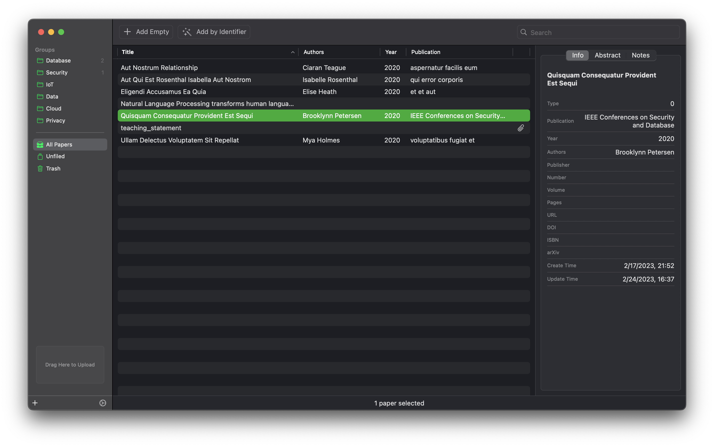

# Paperoad

Paperoad, a reference and publication management application in macOS.

## Road map

- [x] Group create
- [ ] Group delete
- [ ] Tag implementation
- [x] Add empty paper
- [ ] Add paper by DOI, ISBN, or arXiv
- [x] Add paper by pdf file
- [x] Update paper details
- [x] Paper soft delete
- [ ] Paper delete permanently
- [x] Show papers using table
- [ ] Show papers using list
- [x] Show unfiled papers (ungrouped)
- [x] Sort paper by title
- [ ] Search paper
- [x] Open paper's attached pdf file
- [x] Dark appearance, light appearance
- [x] Set storage folder
- [ ] PDF thumbnail
- [ ] PDF OCR
